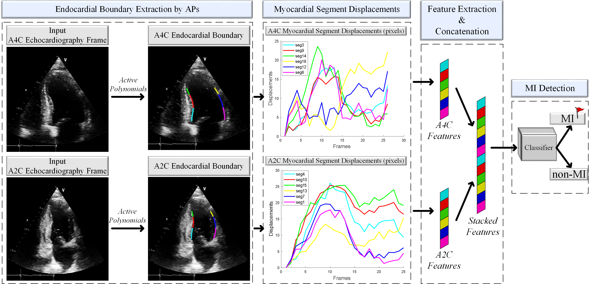

## MultiEchoAI
# Early Myocardial Infarction Detection over Multi-view Echocardiography

This repository includes the implementation of the myocardial infarction (MI) detection framework that leverages Artificial Intelligence (AI) models using multi-view echocardiography in [Early Myocardial Infarction Detection over Multi-view Echocardiography](https://arxiv.org/abs/2111.05790).

<p align="center">

</p>
<p align="center">
<em>The proposed AI-based myocardial infarction detection framework over multi-view echocardiography.</em>
</p>


### Content
- [Software environment using conda](#Software-environment-using-conda)
- [Getting started with HMC-QU Dataset](#Getting-started-with-HMC-QU-Dataset)
- [Active Polynomial features extracted from HMC-QU Dataset](#Active-Polynomial-features-extracted-from-HMC-QU-Dataset)
- [Myocardial infarction detection by AI-models](#Myocardial-infarction-detection-by-AI-models)
- [Citation](#Citation)


### Software environment using conda
```
conda create -n echoAI python=3.9
conda activate echoAI
conda install tensorflow-gpu
conda install scikit-learn=1.1.1
```

### Getting started with HMC-QU Dataset
HMC-QU dataset is the first publicly shared dataset serving myocardial infarction detection on the left ventricle wall. The dataset includes a collection of apical 4-chamber (A4C) and apical 2-chamber (A2C) view 2D-echocardiography recordings. 

Download the HMC-QU dataset from the link below or using the Kaggle API: https://www.kaggle.com/datasets/aysendegerli/hmcqu-dataset

```
kaggle datasets download -d aysendegerli/hmc-qu-dataset
unzip hmc-qu-dataset.zip
```

### Active Polynomial features extracted from HMC-QU Dataset
In this repository, we share the features extracted by Active Polynomials (APs) and their corresponding ground-truth labels in folder /APs_Features. For an easy experimental usage, data splits of single-view (A2C and A4C) and multi-view are given in folder /DataSplits.


### Myocardial infarction detection by AI-models
The detection of myocardial infarction can be carried out for each AI-model with respect to the given echocardiography view as follows:
```
python train.py --view multi
python train.py --view 2CH
python train.py --view 4CH
```
To specify the GPUs in a server, the code also be executed as follows:
```
python train.py --gpu 0 --view multi
python train.py --gpu 1 --view 2CH
python train.py --gpu 2 --view 4CH
```


### Citation
If you use the implementation provided in this repository, please cite the following paper:

```
@article{DEGERLI2024105448,
title = {Early myocardial infarction detection over multi-view echocardiography},
journal = {Biomedical Signal Processing and Control},
volume = {87},
pages = {105448},
year = {2024},
doi = {https://doi.org/10.1016/j.bspc.2023.105448},
author = {Aysen Degerli and Serkan Kiranyaz and Tahir Hamid and Rashid Mazhar and Moncef Gabbouj}
}
```

